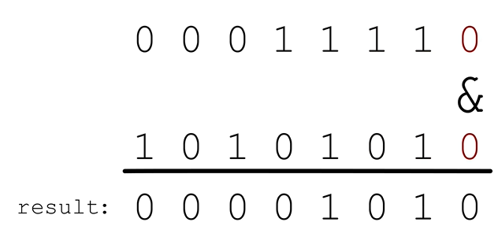
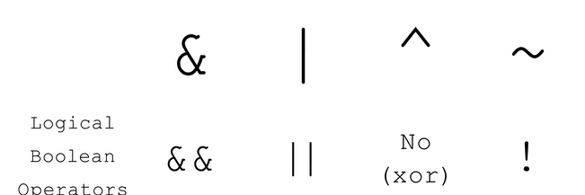
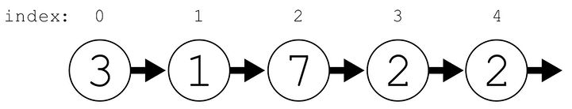

## Tree
```py
# Definition for a binary tree node.
# class TreeNode:
#     def __init__(self, val=0, left=None, right=None):
#         self.val = val
#         self.left = left
#         self.right = right
class Solution:
    def checkTree(self, root: Optional[TreeNode]) -> bool:
        return root.left.val + root.right.val == root.val
```

<br><br>

## bitwise operators

Biwise operators:
  - &
  - | 
  - ^
  - ~




<br>

Ex: Number of Steps to Reduce a Number to Zero
- Given an integer num, return the number of steps to reduce it to zero.
- In one step, if the current number is even, you have to divide it by 2, otherwise, you have to subtract 1 from it.

We can solve this problem by using bitwise operators. For that, we need to know:
- An odd number in binary always has the less-significant bit of 1
- To halve a number in binary we can shift all the bits to the right by one place. Ex: 30 = 11110 -> 15 = 1111
    - to shift the bits to the right we use the >> operator

```py3
class Solution:
    """
    Time:   O(log(n))
    Memory: O(1)
    """

    def numberOfSteps(self, num: int) -> int:
        steps = 0

        while num > 0:
            if num & 1:
                num -= 1
            else:
                num >>= 1
            steps += 1

        return steps
```

<br><br>

## linked list


Ex: find the middle of a linked list
```py3
# Definition for singly-linked list.
# class ListNode:
#     def __init__(self, val=0, next=None):
#         self.val = val
#         self.next = next
class Solution:
     """
    Time:   O(n)
    Memory: O(1)
    """

    def middleNode(self, head: Optional[ListNode]) -> Optional[ListNode]:
        fast = head 
        slow = head

        while fast and fast.next:
            fast = fast.next.next
            slow = slow.next

        return slow
```